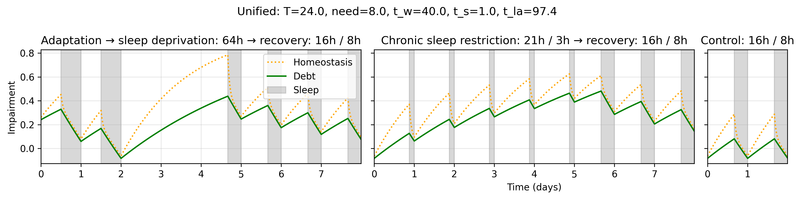

# Sleep

This package provides tools for analyzing and simulating sleep pressure dynamics from sleep diaries. Currently supported models:

- Unified sleep model [1]

---

## Table of Contents

1. [Installation](#installation)
2. [Getting started](#getting-started)
3. [Sleep diary](#sleep-diary-format)
4. [Contributions](#contributions)
5. [References](#references)

---

## Installation

To install **sleep** directly from Git:

```bash
pip install git+https://github.com/AdrienSpecht/sleep.git@main
```

Alternatively, with Poetry:

```bash
poetry add git+https://github.com/AdrienSpecht/sleep.git@main
```

## Getting started

### Sleep diary format

Sleep diaries should be provided with the following columns:

- `key`: A string identifier for the sleep schedule (e.g., "Control: 16h / 8h")
- `asleep`: Time in hours when sleep begins (can be empty for initial wake state)
- `awake`: Time in hours when sleep ends

Example:

| key               | asleep | awake |
| ----------------- | ------ | ----- |
| Control: 16h / 8h |        | 0.0   |
| Control: 16h / 8h | 16.0   | 24.0  |
| Control: 16h / 8h | 40.0   | 48.0  |

Each row represents a sleep-wake cycle, where:

- The first row typically starts with an empty `asleep` value and `awake=0.0` to indicate the initial wake state. We assume a rested state at the beginning.
- Subsequent rows contain the sleep onset (`asleep`) and wake time (`awake`) in hours
- Multiple sleep schedules can be included, distinguished by their `key` values

### Example

With the provided `data/diary.csv` file:

```python
import pandas as pd
from sleep import Model

# Load your sleep diary
diary = pd.read_csv("data/diary.csv")

# Initialize the unified model
model = Model("unified", diary)

# Compute sleep pressure for a specific diary and time points
key = "Control: 16h / 8h"  # diary identifier
time = [10, 15, 50]  # time points in hours
out = model.compute(key=key, time=time)

# Plot the results
fig, axs = model.plot(key=diary.key.unique())
```



## Contributions

Contributions are welcome! Please feel free to submit a Pull Request.

## References

[1] BP. Rajdev et al., "A unified mathematical model to quantify performance impairment for both chronic sleep restriction and total sleep deprivation.", from Journal of theoretical biology. 2013.
